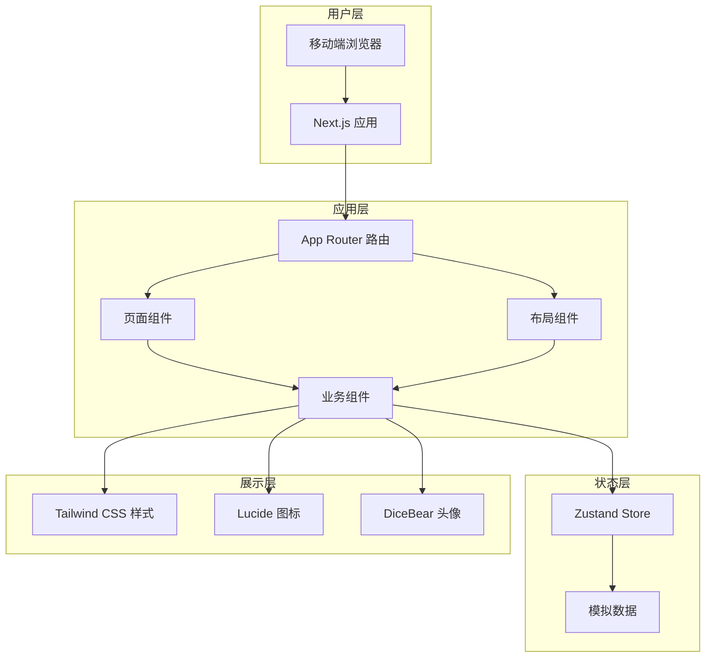
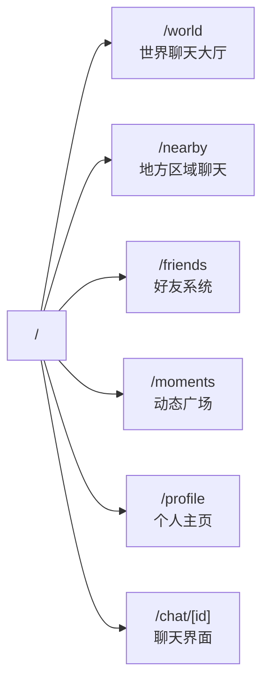
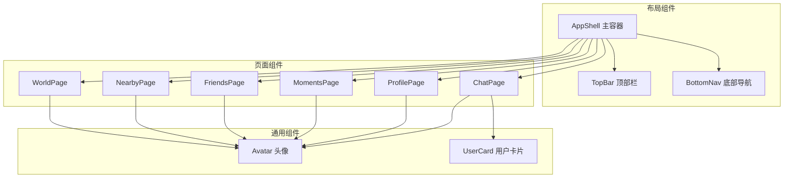
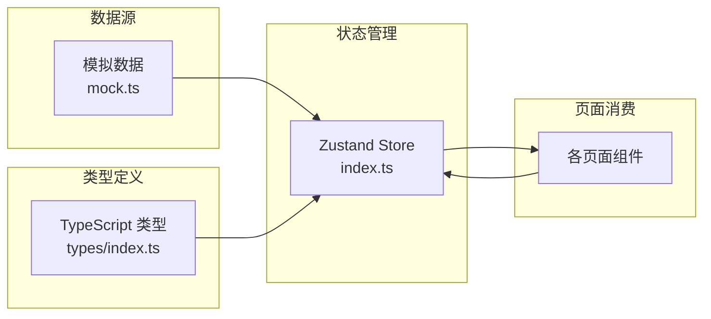
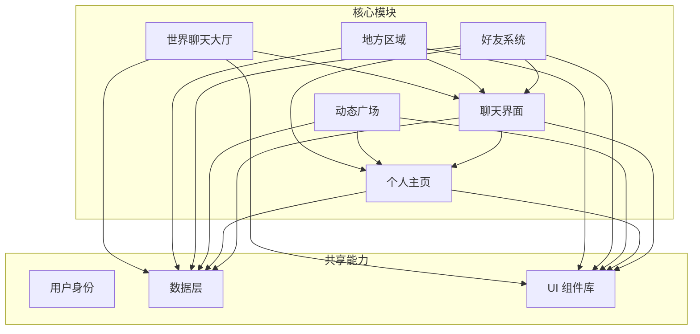
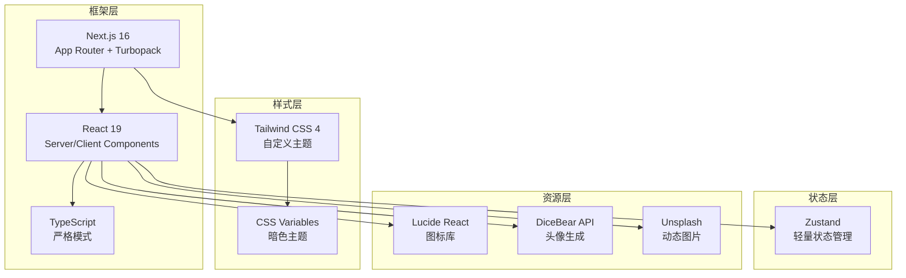
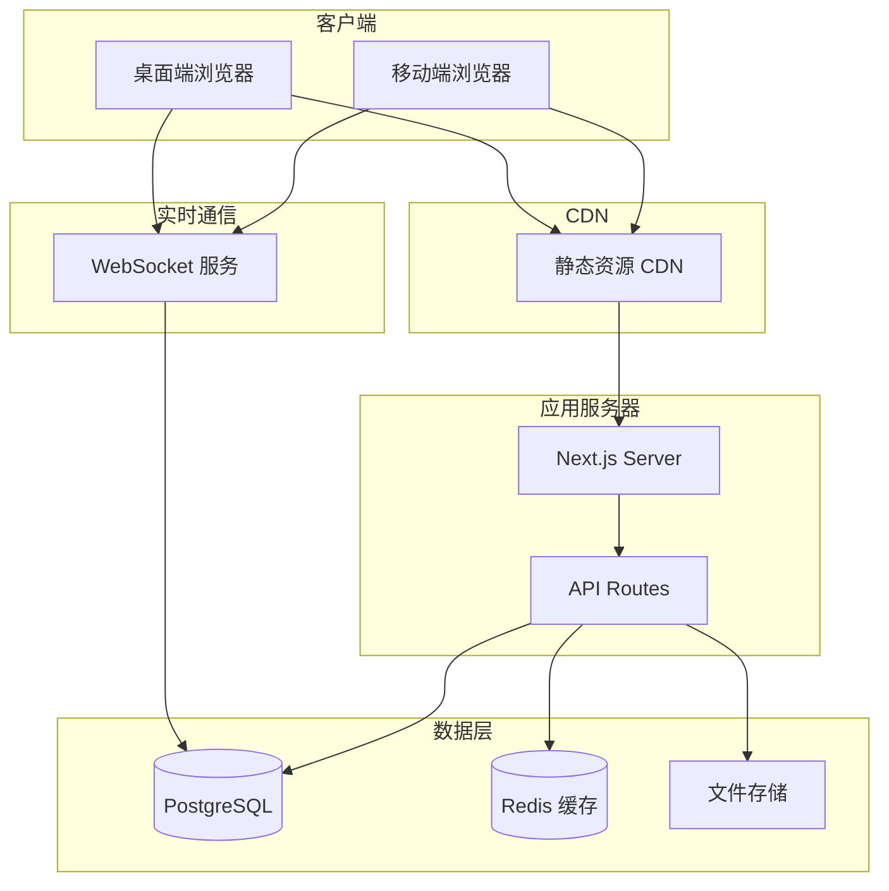

# OPEN 无界社交平台 - 项目架构图

## 系统架构

```mermaid
graph TB
    subgraph 用户层
        A[移动端浏览器] --> B[Next.js 应用]
    end

    subgraph 应用层
        B --> C[App Router 路由]
        C --> D[页面组件]
        C --> E[布局组件]
        D --> F[业务组件]
        E --> F
    end

    subgraph 状态层
        F --> G[Zustand Store]
        G --> H[模拟数据]
    end

    subgraph 展示层
        F --> I[Tailwind CSS 样式]
        F --> J[Lucide 图标]
        F --> K[DiceBear 头像]
    end
```

## 页面路由结构

```mermaid
graph LR
    Root["/"] --> World["/world<br/>世界聊天大厅"]
    Root --> Nearby["/nearby<br/>地方区域聊天"]
    Root --> Friends["/friends<br/>好友系统"]
    Root --> Moments["/moments<br/>动态广场"]
    Root --> Profile["/profile<br/>个人主页"]
    Root --> Chat["/chat/[id]<br/>聊天界面"]
```

## 组件层级

```mermaid
graph TB
    subgraph 布局组件
        AppShell[AppShell 主容器]
        TopBar[TopBar 顶部栏]
        BottomNav[BottomNav 底部导航]
    end

    subgraph 通用组件
        Avatar[Avatar 头像]
        UserCard[UserCard 用户卡片]
    end

    subgraph 页面组件
        WorldPage[WorldPage]
        NearbyPage[NearbyPage]
        FriendsPage[FriendsPage]
        MomentsPage[MomentsPage]
        ProfilePage[ProfilePage]
        ChatPage[ChatPage]
    end

    AppShell --> TopBar
    AppShell --> BottomNav
    AppShell --> WorldPage
    AppShell --> NearbyPage
    AppShell --> FriendsPage
    AppShell --> MomentsPage
    AppShell --> ProfilePage
    AppShell --> ChatPage

    WorldPage --> Avatar
    NearbyPage --> Avatar
    FriendsPage --> Avatar
    MomentsPage --> Avatar
    ProfilePage --> Avatar
    ChatPage --> Avatar
    ChatPage --> UserCard
```

## 数据流

```mermaid
graph LR
    subgraph 数据源
        MockData[模拟数据<br/>mock.ts]
    end

    subgraph 状态管理
        Store[Zustand Store<br/>index.ts]
    end

    subgraph 类型定义
        Types[TypeScript 类型<br/>types/index.ts]
    end

    subgraph 页面消费
        Pages[各页面组件]
    end

    MockData --> Store
    Types --> Store
    Store --> Pages
    Pages --> Store
```

## 功能模块依赖

```mermaid
graph TB
    subgraph 核心模块
        World[世界聊天大厅]
        Nearby[地方区域]
        Friends[好友系统]
        Moments[动态广场]
        Profile[个人主页]
        Chat[聊天界面]
    end

    subgraph 共享能力
        Auth[用户身份]
        Data[数据层]
        UI[UI 组件库]
    end

    World --> Chat
    Nearby --> Chat
    Friends --> Chat
    Friends --> Profile
    Moments --> Profile
    Chat --> Profile

    World --> Data
    Nearby --> Data
    Friends --> Data
    Moments --> Data
    Profile --> Data
    Chat --> Data

    World --> UI
    Nearby --> UI
    Friends --> UI
    Moments --> UI
    Profile --> UI
    Chat --> UI
```

## 技术栈层次

```mermaid
graph TB
    subgraph 框架层
        Next["Next.js 16<br/>App Router + Turbopack"]
        React["React 19<br/>Server/Client Components"]
        TS["TypeScript<br/>严格模式"]
    end

    subgraph 样式层
        Tailwind["Tailwind CSS 4<br/>自定义主题"]
        CSS["CSS Variables<br/>暗色主题"]
    end

    subgraph 状态层
        Zustand["Zustand<br/>轻量状态管理"]
    end

    subgraph 资源层
        Lucide["Lucide React<br/>图标库"]
        DiceBear["DiceBear API<br/>头像生成"]
        Unsplash["Unsplash<br/>动态图片"]
    end

    Next --> React
    React --> TS
    Next --> Tailwind
    Tailwind --> CSS
    React --> Zustand
    React --> Lucide
    React --> DiceBear
    React --> Unsplash
```

## 部署架构（规划）

```mermaid
graph TB
    subgraph 客户端
        Mobile[移动端浏览器]
        Desktop[桌面端浏览器]
    end

    subgraph CDN
        Static[静态资源 CDN]
    end

    subgraph 应用服务器
        NextServer[Next.js Server]
        API[API Routes]
    end

    subgraph 数据层
        DB[(PostgreSQL)]
        Redis[(Redis 缓存)]
        Storage[文件存储]
    end

    subgraph 实时通信
        WS[WebSocket 服务]
    end

    Mobile --> Static
    Desktop --> Static
    Static --> NextServer
    NextServer --> API
    API --> DB
    API --> Redis
    API --> Storage
    Mobile --> WS
    Desktop --> WS
    WS --> DB
```
